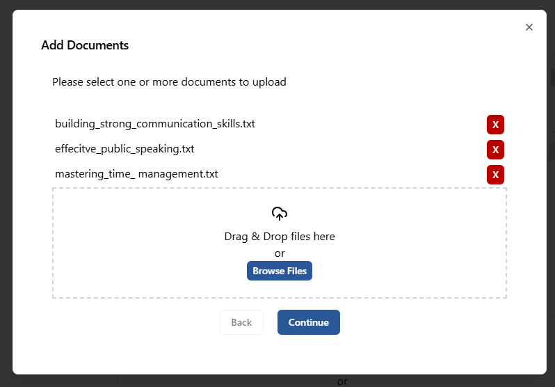
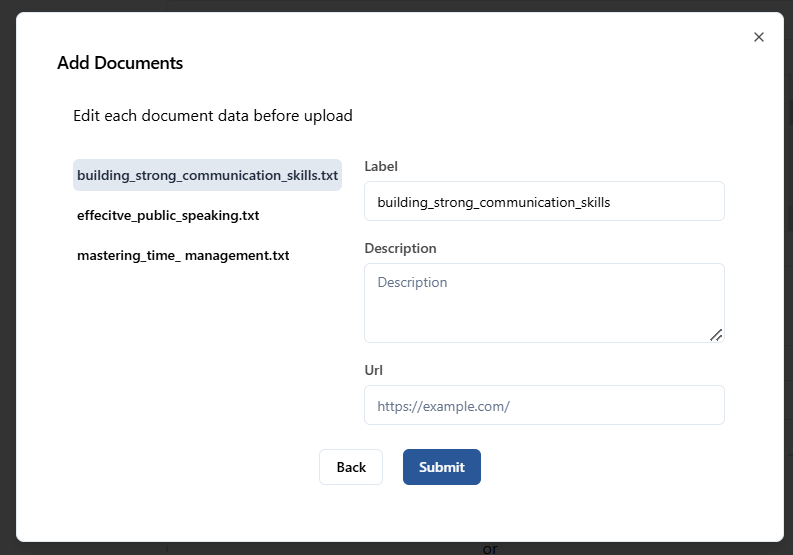
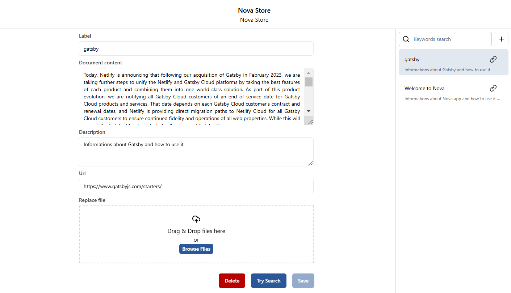
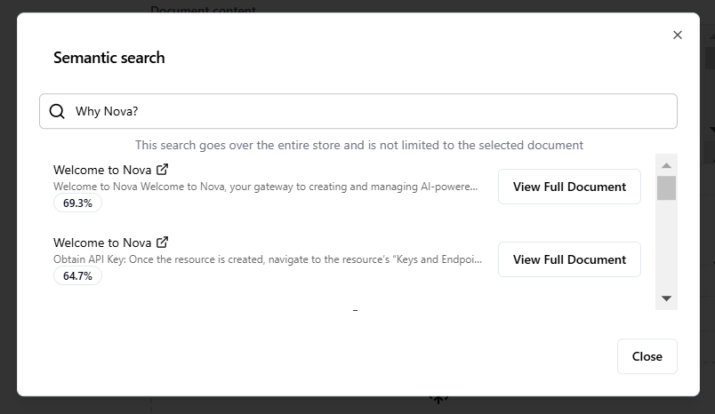

## Document Search Addon: A Closer Look

One of the most commonly used addons in AI systems is the **Document Search Addon**. This addon allows users to efficiently search through extensive collections of documents, files, and other textual data. Whether it’s a small internal knowledge base or a vast repository of customer data, this addon makes it easy for users to find the specific information they need.

## Features of the Document Search Addon
- **Fast Indexing**: It can index large volumes of documents in real-time, allowing for quick search and retrieval.
- **Query Optimization**: The addon can interpret user queries, providing relevant results even when the exact search terms aren’t used.
- **Integration with File Systems**: Document Search Addons often integrate with external file systems (e.g., Google Drive, SharePoint), allowing users to search files stored across different platforms.
- **Search Suggestions**: As the user types, the addon can offer real-time search suggestions to improve accuracy and efficiency.
- **Faceted Search**: Users can filter search results by categories such as date, file type, or relevance.

By utilizing a Document Search Addon, organizations can enhance their AI systems with a robust and efficient tool for managing and accessing information. This is especially useful in industries where documentation and compliance are critical, such as healthcare, law, and finance.

## Adding Documents to the Document Search Addon
To add documents to the Document Search Addon, follow these steps:

- **Upload Files**: Begin by uploading the files you wish to add. You can upload multiple files at once, allowing efficient batch processing.

  
  
<em>Add documents to Document Search Addon</em>

- **Customize File Metadata**: After uploading, you have the option to customize each file by:
  - _**Changing the Label**: Assign a label to help identify the file more easily._
  - _**Adding a Description**: Provide a brief description of the document to summarize its content._
  - _**Specifying a URL**: If applicable, include a relevant URL for further reference or access to related online resources._
- **Submit the Files**: Once you've uploaded and customized the files, click the "Submit" button to finalize the process.

  
  
<em>Customizing File Metadata</em>

## Document Chunks
As mentioned, each uploaded document is split into chunks for easy management. Every chunk is composed of the following fields:

- **Label**: A brief identifier or name for the chunk.
- **Content**: The actual content or body of the chunk.
- **Description**: A short description summarizing the chunk's content.
- **URL**: A reference URL, if applicable.

#### Chunk Management
- **Update**: Users can modify the label, description and URL of each chunk.
- **Delete**: Users can delete chunks as needed.
- **Replace**: Users can replace the file for the selected chunk, which will update the content accordingly.

  
  
<em>List of chunks and chunk management</em>

## Semantic Search
The addon features a 'Try Search' button, which initiates a semantic search. This advanced search system allows users to search for information across the entire document store. The search is not limited to a single document, meaning that it can scan and return results from any and all documents stored in chunks.

How Semantic Search Works:
- **Comprehensive Scanning**: When the search is initiated, the system goes over every chunk in the document store to find the most relevant results based on the search query.
- **Deep Understanding**: The semantic search analyzes the meaning behind the search query, providing more accurate and relevant results compared to a standard keyword search.

  
  
<em>Semantic search</em>

#### Search Results
After the search is completed, the user is presented with the most relevant results or the document most likely to contain the answer. This likelihood is measured by a score, which is a percentage indicating the probability that the chatbot will return the result with the desired information.
Document can be viewed in full detail by clicking the 'View Full Document' button.
