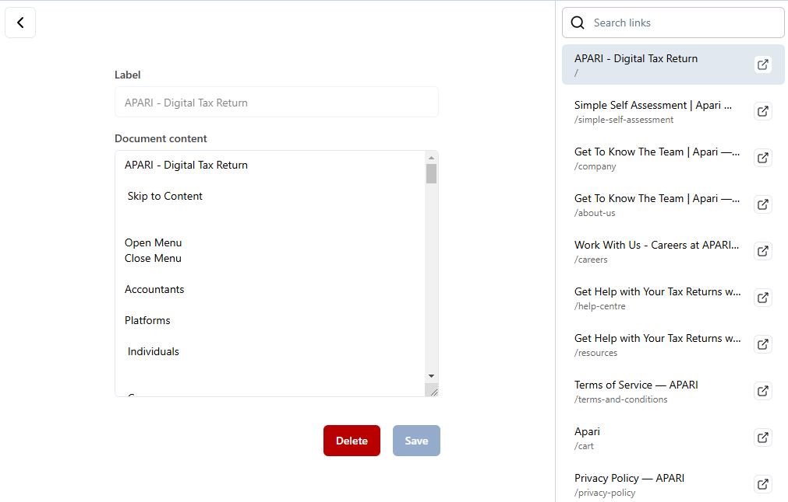

A website crawler is an addon that performs server-side rendering, indexes pages within a domain, and extracts text content from crawled pages. This documentation provides an overview of the web crawler’s functionality, focusing on domain management, background crawling, and link content editing.

## 1.Overview
The web crawler is a tool that allows users to add domains to a list, where the system crawls and fetches links and content from those domains in the background. Users can manage their domains and associated links, edit content, and control the crawling process through a simple interface.

## 2. Features

### 2.1. Domain List
The domain list is the primary interface where users can view and manage the domains they have added for crawling. The list includes the following functionality:
- **Add Domain**: A form allows users to add a new domain to the list. Once a domain is added, the system automatically starts crawling and fetching links and content for that domain in the background. Users can continue to use the application normally while the crawling process happens.
- **View Domains**: All added domains are displayed in a list. Each domain entry includes options for editing or deleting the domain.

  
  
<em>Click the '+' button to add a domain</em>

### 2.2. Background Crawling
When a domain is added to the system, crawling and fetching links occur in the background. This means users can perform other activities while the crawler operates. The results (i.e., the list of links) will be available when users click on the "Edit" button for the domain.
- **Stop Crawling**: Users can stop the background crawling process at any time by clicking a dedicated button next to the domain in the list.

  

  
<em>Background crawling</em>

### 2.3. Edit Domain
Each domain has an Edit button that opens a new page containing a list of all the crawled links for that specific domain. The page provides several options for managing the links:
- **Visit link**: Each link is listed with a button that allows users to visit the actual URL in their browser.
- **Edit Link Content**: In the middle of the page, a form is provided where users can edit the fetched content of the selected link. This allows users to modify the text or other content that the crawler has fetched.
- **Delete Link**: Each link has a delete button that allows users to remove the link and its associated content from the system.

  
  
<em>Browse or search for the desired link and edit link content</em>

### 2.4. Delete Domain
Each domain in the list also has a Delete button, allowing users to remove the domain entirely from the system, including all associated links and content.

## 3. Usage Flow
- **Add a domain**: Use the form to add a new domain to the list. Background crawling will start immediately, and the system will fetch links from the domain.
- **Manage Crawling**: View the domain list to monitor progress or stop the crawling process using the "Stop Crawling" button if needed.
- **Edit Domain Links**: Click the "Edit" button next to a domain to view the list of crawled links. Use the form to edit content or delete specific links.
- **Delete a Domain**: Remove a domain and all its associated data using the "Delete" button in the domain list.
