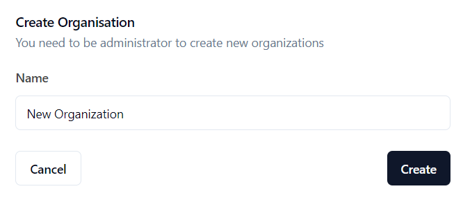

## How Nova Works

Nova is built with ease of use in mind, and even if you’re new to AI, you’ll find the platform straightforward to navigate. Here’s a breakdown of how you can get started with Nova:

## 1. Create an Organization

Before you can create a chatbot or add LLM keys, you need to set up an organization within Nova.

1. **Log in** to Nova’s dashboard.
2. **Navigate to the Organizations Section**: Find this in the left corner below the main navigation menu.
3. Hover on **Switch Organization** and **Click the “+ New Organization” Button** to create a new organization.

  
  
<em>Example of creating a new organization</em>

4. **Fill in the Details**: Provide a name for your organization.
5. **Save**: Click the “Create” button to finalize your organization setup.

  
  
<em>Example of creating a new organization</em>

## 2. Add LLM Keys

With your organization set up, the next step is to add your LLM (Large Language Model) API keys.

1. **Navigate to the LLM Providers Section**: Found under the settings or integrations menu.
2. **Select “+" to Add LLM Provider**: Choose from available providers like OpenAI, Azure, Groq, or Anthropic.
3. **Enter API Key**: Provide the API key for the selected provider.
4. **Configure Settings**: Set any additional configurations required by the provider.
5. **Save**: Click “Save” to store your API key.

For more details, visit [Learn how to create an LLM provider](../getting-started/llm-providers).

## 3. Create Your First Chatbot

Start by logging into Nova’s dashboard and selecting the option to create a new chatbot. You will be prompted to give your chatbot a name, define its role or purpose, and customize its behavior. This process takes just a few minutes, after which your chatbot is ready to be tested.

- **Choose a unique name** for your chatbot.
- **Define its purpose** (e.g., customer service bot, assistant, or information provider).
- **Optionally, customize** how the chatbot should respond—whether it should have a formal tone, a friendly style, or something else.

For more details, visit [Learn how to create a Chatbot](../getting-started/bots).

## 4. Connect an AI Provider

Once you’ve set up your chatbot, the next step is to configure an AI provider. Nova allows you to connect to one or multiple AI providers, depending on your preferences.

- **Add an AI Provider**: Select an AI provider from the available options (OpenAI, Azure, Groq, Anthropic).
- **Enter API Key**: For each provider, Nova will ask for your API key, which you can securely enter within the platform.
- **Test Connection**: Verify that the chatbot is successfully communicating with the chosen AI provider.

You can always switch AI providers later to test different configurations or optimize performance.

## 5. Interact with Your Chatbot

Once your chatbot is set up and connected to an AI provider, you can begin interacting with it using Nova’s built-in UI. Simply navigate to the chatbot interface and start sending prompts.

- **Send a Prompt**: Type a question or command to the chatbot (e.g., “What’s the weather like today?” or “Can you summarize this document?”).
- **Receive Responses**: The chatbot will analyze the input and respond based on the configured AI provider.
- **Refine**: As you interact with your chatbot, you can identify areas for improvement and fine-tune its behavior through the Nova dashboard.

---
