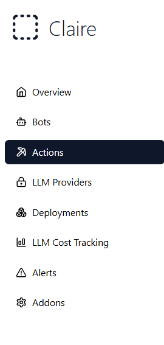
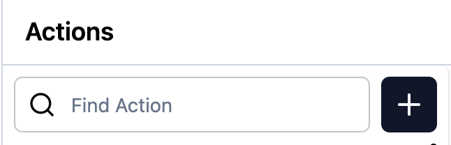
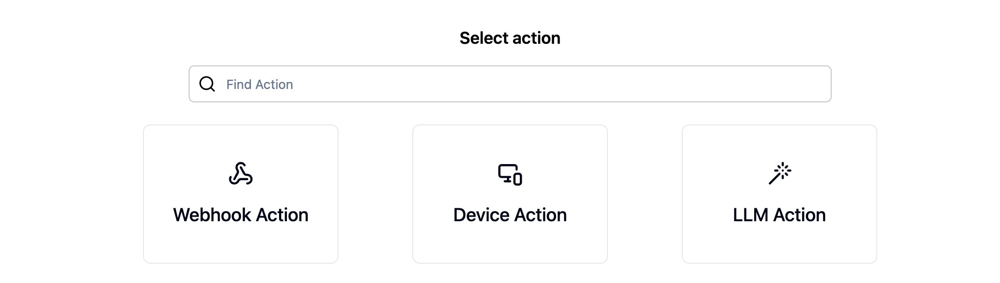
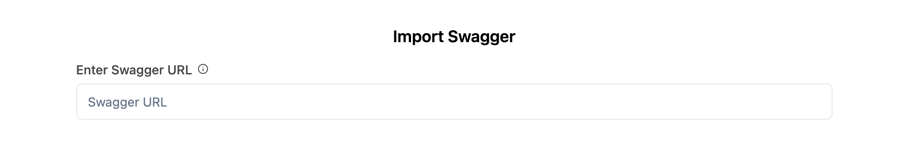
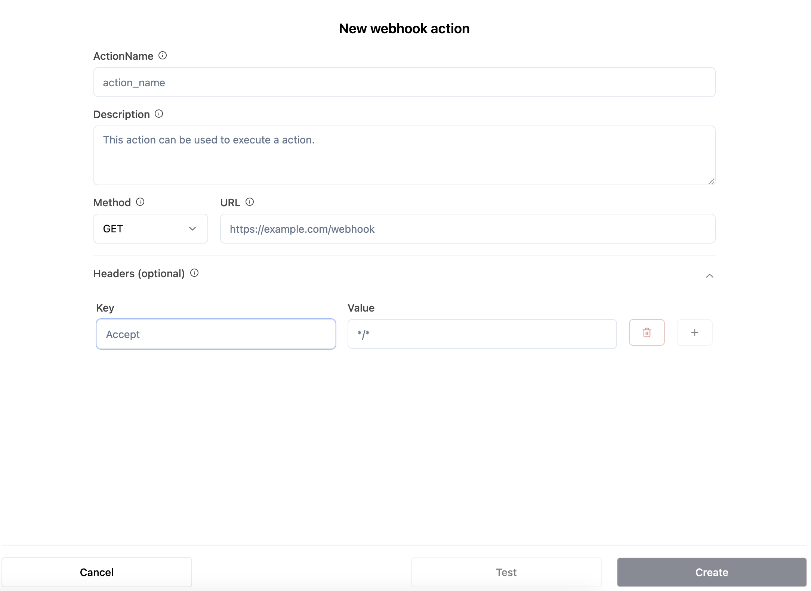
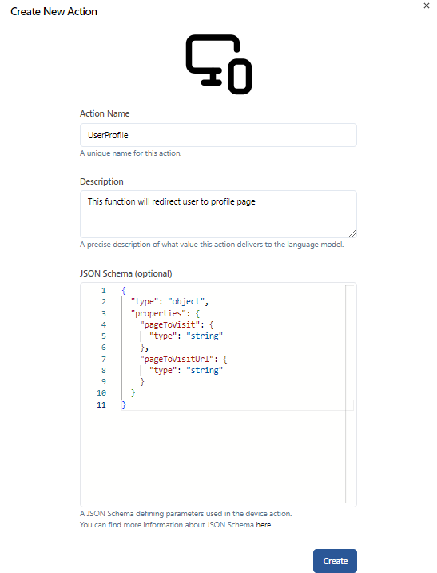

Actions in AI systems refer to functions or operations that the AI performs in response to specific triggers or events. These actions can vary widely depending on the system’s design, the data it processes, and the webhooks or APIs that enable integration with external platforms. In modern AI applications, actions are often critical in connecting various workflows, such as automating responses, retrieving data, or performing complex computations based on user inputs.

----------------------------------

## 1. What Are Actions?

Actions are the functional building blocks of AI-driven workflows. They are specific tasks executed when certain conditions are met. These conditions are driven by user interaction, external system inputs (via APIs or webhooks), or internal AI triggers.

For example, in a chatbot AI, actions can include:
- **Sending a message**: The chatbot sends a predefined or dynamically generated message in response to a user query.
- **Calling an API**: The chatbot makes an HTTP request to an external service to retrieve data, such as fetching weather information or querying a database.
- **Executing a function**: The AI performs a complex action, such as validating input, computing a result, or launching another workflow.

----------------------------------

## 2.  Creating Action (Step-by-Step Guide)

Creating an action is an essential step in integrating AI workflows with external systems and automating processes. Follow this example to create an action in the Claire app.

### Step 1: Navigate to the Actions Section
To begin, go to the **Actions** section in the app. This can be found in the main navigation menu.

  
  
<em>Navigate to the Actions section</em>

### Step 2: Click the "+" Button
In the **Actions** section, click the **"+"** button in the top-right corner to start creating a new action, or to add Swagger import.

  
  
<em>Click the '+' button to add a new action or to add Swagger import</em>

### Step 3: Select the Action Type
#### 3.1. After clicking the "+ New" button, you can choose between **Webhook**, **Device** and **LLM** actions.

  
  
<em>Select the action type: Webhook, Device or LLM</em>

#### 3.2. After clicking the "Swagger import", you can enter Swagger URL.

  
  
<em>Enter swagger URL into input field</em>

### Step 4: Configure Action Form
#### Configure the Webhook Action Form (if selected)

If you choose **Webhook** as the action type, you will see a dialog where you can configure the action. Enter the following details:

- **Action Name**: A unique name for this action.
- **Description**: A brief explanation of what this action accomplishes.
- **REST Method**: The HTTP method (e.g., GET, POST) to use when calling the action.
- **URL**: The URL to be called when this action is triggered.
- **Headers** (optional): You can include optional HTTP headers that the action will send in the request. These headers can provide important metadata, such as authentication tokens or content type information.
  - **Add Header**: Click the **"Add Header"** button to enter a **header key** and **value**. You can add multiple headers by clicking "Add Header" again.
  - Example header keys and values:
    - **Content-Type**: Defines the format of the data being sent, such as `application/json`.
    - **Authorization**: Provides credentials required for authentication, such as `Bearer your-token-here`.

- **Create Button**: Save the action configuration by clicking the **Create** button.
- **Test Button**: Test the action by clicking the **Test** button.
- **Cancel Button**: Cancel the action by clicking the **Cancel** button.

### Step 5: Configure the Device Action (if selected)

If you select **Device**, you will see a form to configure the action. Provide the following details:

- **Action Name**: A unique name for the action.
- **Description**: A brief explanation of what the action accomplishes.
- **JSON Schema (optional)**: Define parameters for the device action using a JSON schema.

  
  
<em>Example of a filled-out Device action form</em>

Click **Create** to save the action.

### Summary
You have successfully created a new action in the Claire app. Whether you chose a **Webhook** or **Device** action, ensure that all fields are configured correctly and test the action before deploying it to production.

----------------------------------

## 3. Webhooks and Actions

Webhooks are essential for triggering actions in AI systems. A webhook allows one system to send real-time data to another system, often in response to specific events. In AI applications, webhooks typically:
- **Notify the AI system** of external events, such as form submissions, payment completions, or system alerts.
- **Provide real-time data** from third-party services that the AI system can act upon.

For example, a webhook might trigger an action when a user submits a form on a website. The AI could validate the input, store the data in a database, and send a confirmation message back to the user.

----------------------------------

## 4. Types of Actions in AI Systems

There are various types of actions that an AI can perform depending on the system architecture and integration points. These typically include:

- **Data Retrieval Actions**: Fetching data from external sources such as databases or APIs, which can be used to formulate responses or execute other actions.
- **Processing Actions**: Manipulating or processing data, such as formatting information, performing calculations, applying business logic, or validating inputs.
- **Interaction Actions**: Direct communication with users, such as sending messages, offering suggestions, or providing recommendations based on prior interactions.
- **Notification Actions**: Sending notifications to external platforms like Slack, email, or SMS services.
- **Decision-Making Actions**: In advanced AI systems, actions may involve decision-making processes, where the AI analyzes data and takes corrective actions or escalates issues based on specific triggers.

----------------------------------

## 5. The Role of APIs in AI Actions

APIs (Application Programming Interfaces) are integral to AI actions as they allow the AI system to communicate with external platforms. APIs make it possible to:
- **Send and receive data** between the AI and external services.
- **Perform actions in other systems**, such as updating databases, retrieving information, or triggering other workflows.

This communication is essential for AI systems that rely on data from external sources or that need to interact with third-party platforms to complete their tasks.

----------------------------------

## 6. How Actions Are Triggered

Actions in AI systems are triggered in several ways:
- **User Input**: A user’s query, command, or selection can directly trigger an action, such as responding to a chatbot.
- **Webhook Events**: External events, such as a new customer signing up on a website, can trigger an action in the AI system.
- **Scheduled Events**: Some actions are triggered based on predefined schedules, often used for routine tasks such as periodic data checks or reporting.

----------------------------------

## 7. Building Workflows with Actions

In a complex AI system, actions are typically combined into workflows. A workflow is a sequence of actions that work together to achieve a specific goal. Workflows allow the AI to perform more sophisticated tasks by coordinating multiple actions triggered by a single event or condition.

For instance, a user request could initiate a workflow where the AI first validates the input, then calls an external API to retrieve relevant data, and finally formulates a response or performs another action based on the results.

----------------------------------

## 8. Benefits of AI Actions

The ability to trigger and execute actions in AI systems brings numerous advantages:
- **Automation**: Actions enable the automation of tasks that would otherwise require manual intervention, improving efficiency.
- **Scalability**: Automated actions allow AI systems to handle large volumes of requests or tasks with ease.
- **Personalization**: Actions can be tailored to each user based on their input or preferences, leading to more personalized experiences.
- **Speed**: Automated actions ensure that operations are carried out swiftly and accurately, reducing delays.

----------------------------------

## 9. Challenges in Managing Actions

Despite the advantages, managing actions in AI systems presents several challenges:
- **Complexity**: As the number of actions increases, managing dependencies and ensuring smooth execution can become challenging.
- **Error Handling**: Actions that rely on external systems (via APIs or webhooks) can fail if the external service is unavailable or returns an error.
- **Security**: Ensuring the security of actions is critical, particularly when handling sensitive data or integrating with external platforms.

----------------------------------

In conclusion, actions are vital in AI systems as they allow the execution of functions based on specific triggers, enabling automation, data processing, and interaction with users and external systems. With proper configuration and management, actions can significantly enhance the functionality and efficiency of AI applications.
