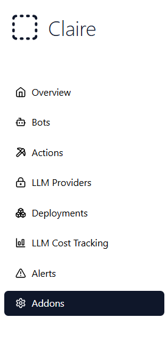
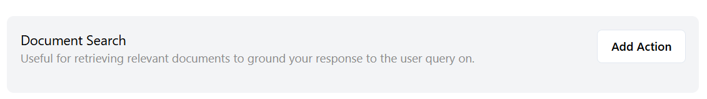
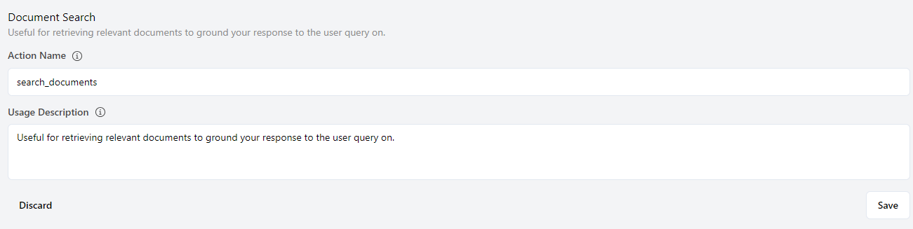
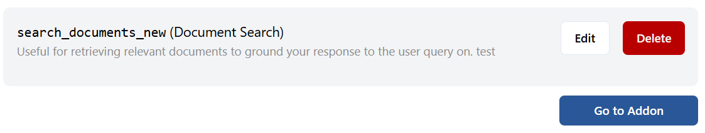

Addons in AI systems function similarly to actions, but with an important distinction: they are external components or features that need to be installed to extend the system’s core functionality. In the context of AI systems, addons enhance capabilities by integrating specific features, such as document search, that are not available in the default setup.

Addons allow users to customize and expand the AI system to suit their particular needs without requiring significant changes to the system’s architecture. They are flexible and versatile, enabling seamless integration with various workflows and external systems.

## 1. What Are Addons?

An addon is an external module or plugin that users can install to add new features or functionalities to the AI system. Unlike built-in actions that are available within the core application, addons need to be installed or activated to work.

In AI systems, addons serve as functional extensions, enabling more specialized tasks such as advanced document search, data mining, or integration with third-party services. By installing addons, users can optimize the system for their specific use cases, whether for personal productivity or large-scale business applications.

For instance, a **Document Search Addon** allows the AI to:
- Index and search large collections of documents quickly.
- Retrieve relevant documents based on user queries.
- Provide real-time search suggestions to improve user experience.

## 2. The Purpose of Addons

Addons are designed to extend the AI system’s functionality beyond what is offered by default. While the core system may handle basic tasks, addons enable more advanced capabilities, such as:
- **Document Search**: Allowing users to search through vast repositories of files, emails, and other text-based data.
- **Integration with Third-Party Services**: Connecting the AI to other platforms (e.g., Google Drive, Slack) through specialized addons.
- **Enhanced Data Processing**: Addons may also perform more complex data transformations, aggregations, or even AI model fine-tuning based on specific needs.
- **Specialized Actions**: Some addons come with predefined actions that can execute tasks within the system, such as processing user inputs, generating reports, or pulling information from external databases.

By offering a modular way to expand the AI’s capabilities, addons make it easy to tailor the system to specific use cases, without overcomplicating the core system for users who don’t need these additional features.

## 3. How Addons Work

Addons are generally designed as plug-and-play modules. Once installed, they integrate seamlessly into the AI system’s existing interface and workflows. The steps to install and configure addons usually include:
1. **Installation**: Users find and install the desired addon, either from an internal marketplace or by uploading a package.
2. **Configuration**: After installation, the addon may require configuration settings, such as API keys, folder locations, or access permissions, to function properly.
3. **Activation**: Once installed and configured, the addon becomes active and can be used within the AI system.
4. **Integration**: Addons often integrate directly with the system’s existing actions or workflows, allowing users to trigger them based on specific events or user inputs.

For example, after installing a Document Search Addon, the AI might have a new action available that allows users to search for documents directly within the AI system. This action can be triggered by a user query or integrated into automated workflows, such as retrieving specific documents based on certain conditions.

## 4. The Benefits of Addons

Addons provide several advantages to AI systems:
- **Customizability**: Users can choose which features they want to add, allowing them to create a highly personalized experience.
- **Scalability**: By adding more addons, the AI system can scale to meet increasing demands or expand its capabilities over time.
- **Efficiency**: Addons enable advanced functionality without requiring significant system overhauls, saving both time and resources.
- **Modularity**: Addons can be installed, updated, or removed independently of the core system, ensuring that changes can be made without disrupting the main application.

For organizations dealing with large volumes of documents, a Document Search Addon can greatly enhance productivity by enabling employees to quickly locate and access information, reducing time spent on manual searches.

## 5. Types of Addons

AI systems support a wide range of addons, depending on the use case. Common types include:

- **Document Search Addons**: These enable users to search for specific files, emails, or text-based content within large datasets.

- **Data Integration Addons**: These addons allow the AI system to connect with external databases, APIs, or data lakes, making it possible to pull in information from various sources.

- **Reporting Addons**: These generate automated reports based on predefined data inputs or user queries.

- **Communication Addons**: These integrate with messaging platforms (e.g., Slack, Microsoft Teams) to send and receive information, notifications, or alerts.

## 6. Installing and Managing Addons

Installing and managing addons is a straightforward process. Follow these steps to install and configure an addon in the AI system.

### Step 1: Go to the Addons Section
Navigate to the **Addons** section in the app. This section can be found in the main navigation menu.

  
  
<em>Navigate to the Addons section in the app</em>

### Step 2: Browse or Search for the Desired Addon
In the Addons section, browse or use the search function to find the addon you want to install (e.g., Document Search Addon).

  
  
<em>Browse or search for the desired addon</em>

### Step 3: Click the "Add action" Button

  
  
<em>"Add action" button to begin addon activation</em>

### Step 4: Configure the Addon
Follow the on-screen instructions to configure the addon. This may include setting up required configurations.

  
  
<em>Configure the addon</em>

### Step 5: Activate the Addon
After configuration, activate the addon by clicking **"Save"** button. This will make the addon available for use within the AI system. By clicking the 'Go to Addon' button, you can view more details about the selected addon.

  
  
<em>Activated addon and 'Go to addon' button</em>

### Summary
You have successfully installed and activated an addon. The addon is now available for use within the AI system. You can integrate it into your workflows or use it as needed.

## 7. Challenges and Considerations

While addons offer powerful capabilities, there are some challenges and considerations to keep in mind:
- **Compatibility**: Not all addons are compatible with every version of an AI system. Ensure that the addon you wish to install is compatible with your system.
- **Maintenance**: Addons require regular updates to remain secure and functional, particularly when connected to external APIs or services.
- **Security**: Since addons often interact with external systems, it’s important to ensure they meet your organization’s security standards to avoid potential vulnerabilities.
- **Performance**: Depending on the addon, there may be performance impacts, particularly if the addon processes large datasets or integrates with multiple external services.

## How to Create Addons

1. **Go to the Addons section** in the app.
2. Click the **"+"** button.

## Conclusion

Addons are an essential part of modern AI systems, providing users with the flexibility to enhance and tailor their systems to meet specific needs. Whether you're adding document search functionality, integrating with external services, or expanding data processing capabilities, addons make it easy to customize your AI system.

By carefully selecting and managing addons, users can create a powerful and efficient AI environment that scales with their needs while maintaining simplicity and ease of use.

