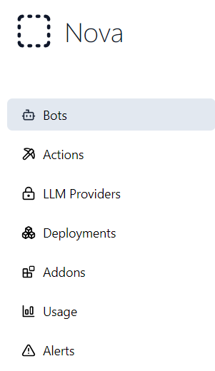
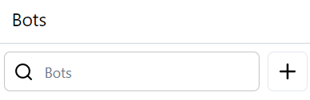
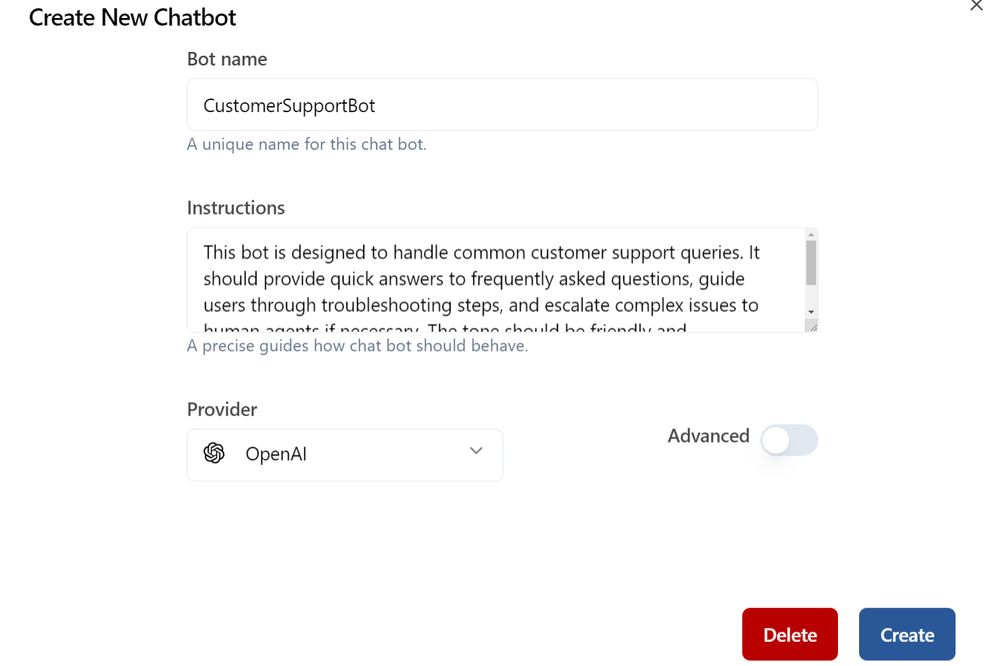
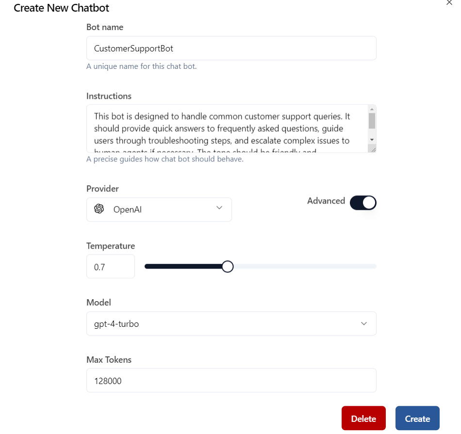
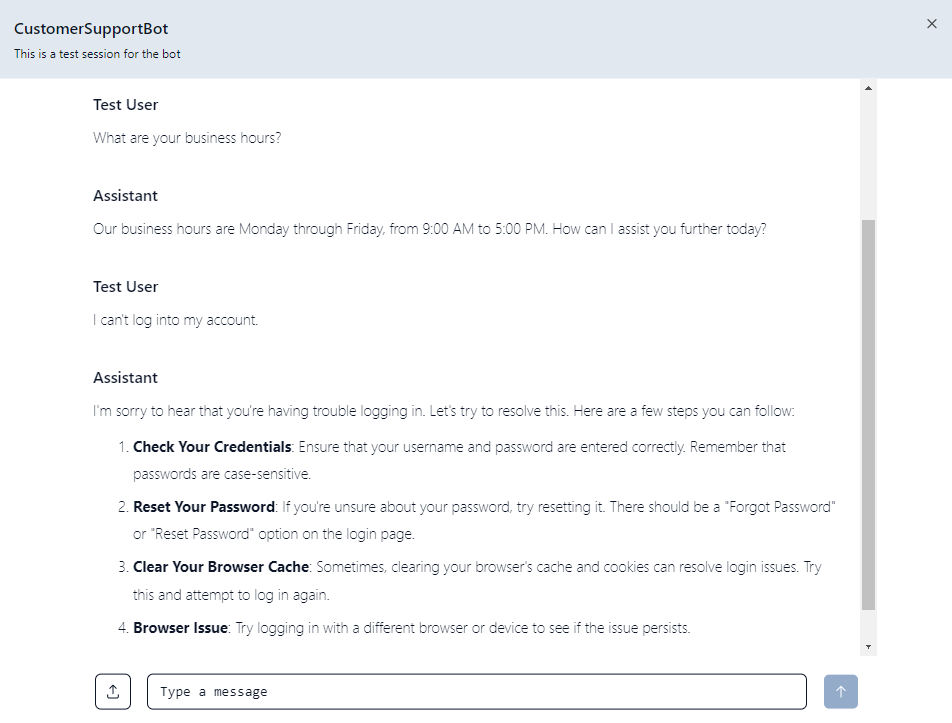

Bots, particularly AI-powered chatbots, are essential tools in modern applications for automating user interactions, providing support, and performing various tasks. Bots use Large Language Models (LLMs) to generate intelligent responses based on user inputs, making them highly adaptable to a wide range of use cases, from customer support to personal assistants.

Before you create a bot, it is important to first create an **LLM provider**. The LLM provider supplies the AI capabilities that power the bot’s responses. [Learn how to create an LLM provider](../../getting-started/llm-providers) before proceeding.

----------------------------------

## 1. What is a Bot?

A bot is an automated software application that interacts with users via text-based or voice-based communication. In AI systems, bots leverage LLMs (like GPT) to understand natural language inputs from users and provide intelligent, context-aware responses.

Bots can be used in various applications, including:
- **Customer Support**: Handling FAQs, troubleshooting, or providing instant assistance.
- **Personal Assistants**: Helping users manage schedules, tasks, and reminders.
- **Sales and Marketing**: Automating product inquiries, guiding users through purchase processes, or generating leads.

----------------------------------

## 2. Bot Fields and Configuration

When creating a bot, several fields must be configured to ensure it functions correctly. These fields define the bot’s personality, behavior, and interaction with users.

### Key Fields for a Bot:
- **Name**: The name of the bot, which is visible to users during interactions. This gives the bot an identity and makes the communication more personal.

- **Instructions**: A set of instructions that define how the bot should behave. This includes the bot’s tone, response style, and other behavioral characteristics.

- **LLM Providers**: A crucial field where you select the LLM provider that powers the bot. The LLM provider is what gives the bot its AI capabilities, allowing it to understand and respond to user queries. Ensure you have created and configured an LLM provider beforehand.

- **Initial Message**: The message that the bot will send as soon as the interaction starts. This message serves as a greeting or introductory message to the user and sets the tone for the conversation.

- **Actions and Responses**: This section allows you to define the initial set of actions and responses that the bot can handle. This could include predefined responses for common queries or dynamic actions such as fetching data from an external API.

### Testing the Bot

Testing is a critical phase in the bot creation process. It ensures that the bot functions as expected and provides a seamless user experience. During the testing phase, you can interact with the bot in a controlled environment to verify its behavior, responses, and overall performance.

**Key Aspects of Testing a Bot:**

- **Test Interactions**: Use the **Try** button to simulate conversations with the bot. This allows you to input various queries and see how the bot responds based on the configured instructions and settings.

- **Verify Responses**: Ensure that the bot provides relevant, accurate, and contextually appropriate responses. Check if the bot handles different scenarios and queries as expected.

- **Adjust Configurations**: Based on the test results, you might need to tweak the bot’s instructions, actions, or other configurations. This iterative process helps in fine-tuning the bot’s performance.

- **User Experience**: Assess how natural and engaging the bot’s interactions are. Testing helps in identifying any areas where the bot’s responses might need improvement for a better user experience.

----------------------------------

## 3. How to Create a Simple Chatbot

Follow these steps to create a simple chatbot in the application:

### Step 1: Navigate to the Bots Section
Go to the **Bots** section in the app.

  
  
<em>Navigate to the Bots section</em>

### Step 2: Click the "+" Button
Click the **"Create"** button to start adding a new bot.

  
  
<em>Click the '+' button to start creating a new bot</em>

### Step 3: Fill Out the Bot Form
You will be presented with a form where you need to fill out the following details:

- **Name**: Enter a unique name for this chatbot.
- **Instructions**: Provide a precise guide on how the chatbot should behave.
- **LLM Provider**: Select the LLM provider that you have created in the LLM Providers section.
 Ensure that the bot is connected with your LLM key to enable AI-powered interactions.

  
  
<em>Example of a filled-out form for creating a bot</em>

### Step 4: Configure Advanced Settings (Optional)
You can also configure advanced settings such as:
- **Temperature**: Controls the randomness of responses.
- **Model**: Choose the specific model to use.
- **Max Tokens**: Set the maximum length of the response.

  
  
<em>Advanced settings for configuring the bot</em>

### Step 5:
- **Create Button**: Save new Chatbot by clicking the **Create** button.

### Testing:
When you create a bot, a **Try** button will appear. You can use this button to test your new chatbot and see how it interacts based on the configurations you've set.

  
  
<em>Example of the Try button and test chat interface for the new chatbot</em>

----------------------------------

## 4. Benefits of Using Bots

Using bots in AI-powered applications offers several advantages, including:
- **24/7 Availability**: Bots can operate continuously without requiring human intervention, ensuring that users always have access to support and information.
- **Efficiency**: Bots can handle multiple user interactions simultaneously, reducing the need for human resources in repetitive or straightforward tasks.
- **Personalization**: By integrating LLMs, bots can adapt their responses based on user preferences or historical interactions, providing a more personalized experience.
- **Scalability**: Bots can scale easily to meet growing demand without compromising response times or user satisfaction.

----------------------------------

## 5. Challenges and Considerations

While bots bring many benefits, there are also challenges that need to be addressed:
- **Accuracy**: Ensuring the bot provides accurate and relevant responses is key to maintaining user trust. Continuous testing and refinement are necessary to improve the bot's performance.
- **Complexity**: Defining complex conversation flows can become challenging as the bot interacts with more users and handles more varied queries.
- **LLM Provider Integration**: Properly integrating the LLM provider is crucial for the bot to function correctly. Issues with the provider’s API or configuration can affect the bot's performance.

----------------------------------

## Conclusion

Bots, powered by LLMs, are highly versatile tools for automating user interactions and enhancing customer experiences. With the ability to personalize responses, handle complex queries, and operate around the clock, bots provide significant value in various AI applications.

By carefully configuring the bot’s fields and thoroughly testing it during creation, you can ensure it performs well in real-world scenarios and meets the needs of your users. Don’t forget to first set up an LLM provider to unlock the full potential of your bot. [Learn more about LLM providers](../../getting-started/llm-providers).
