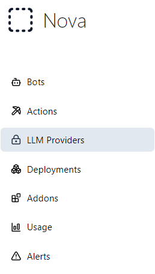
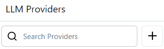
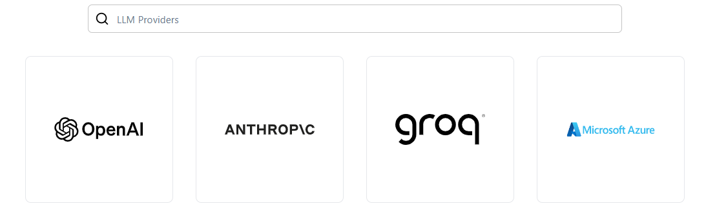
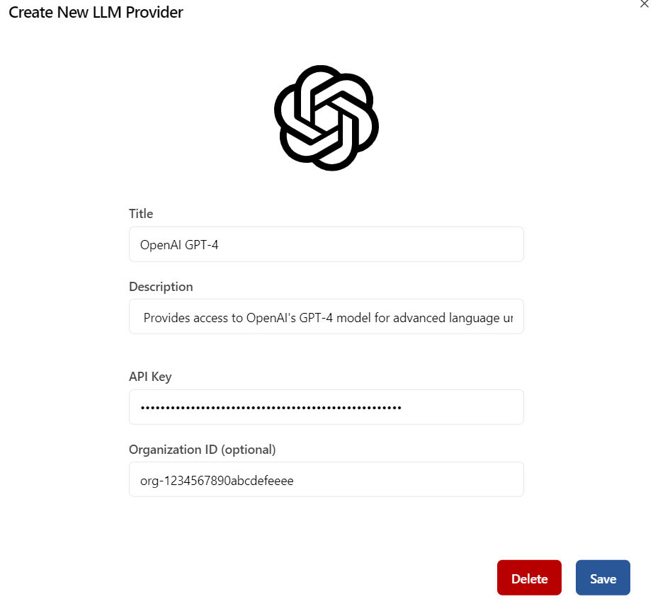
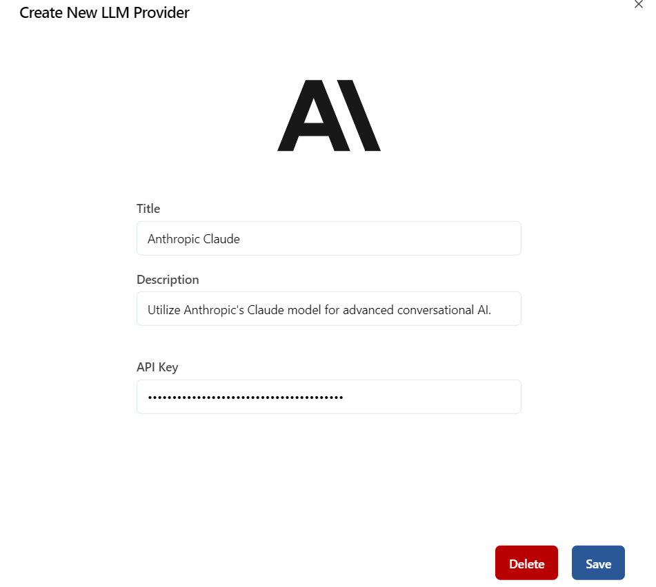
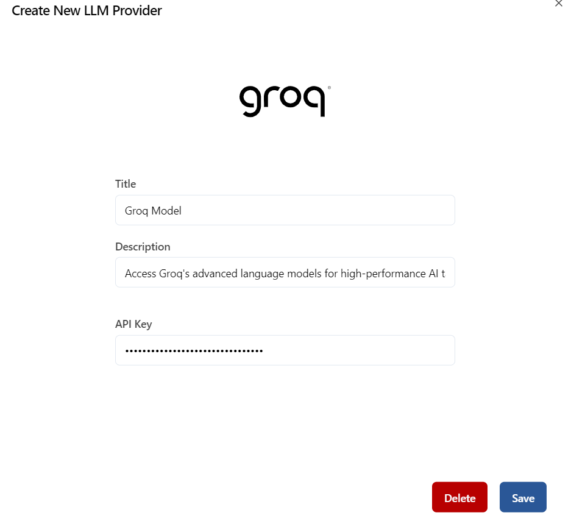
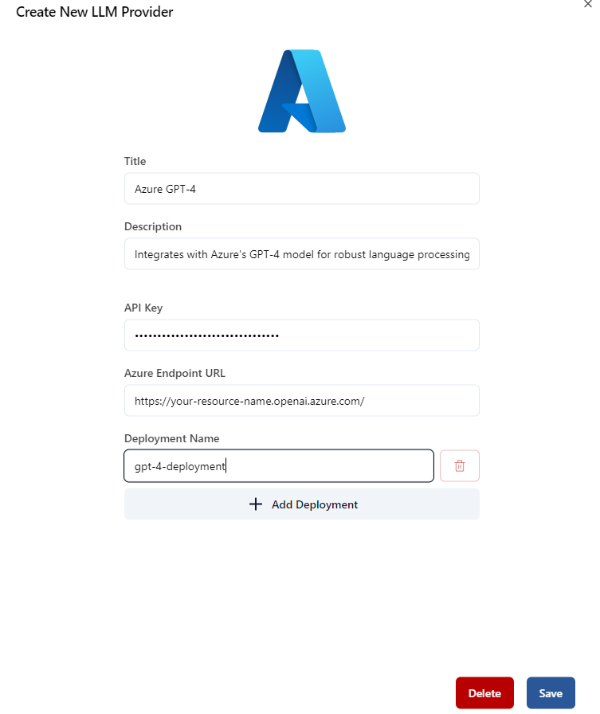

LLM (Large Language Model) Providers are essential for AI-powered applications. They offer advanced language processing capabilities for chatbots, virtual assistants, and more. This guide will help you understand and set up LLM providers effectively.

## 1. What is an LLM Provider?

An LLM provider offers access to Large Language Models (LLMs) that understand and generate human-like language. They are crucial for applications requiring advanced language comprehension.

### Key Functions:
- **Model Hosting**: Hosts language models available via APIs.
- **Model Training**: Trains models on extensive datasets for better performance.
- **API Access**: Provides APIs for integrating LLMs into applications.
- **Scalability**: Ensures models handle varying loads effectively.
----------------------------------

## 2. Role in the AI Ecosystem

LLM providers are at the top of the AI hierarchy. They supply the core technology that powers applications like chatbots and data analysis tools.

### Hierarchical Structure:
1. **LLM Providers**: Provide core language models.
2. **Applications and Services**: Utilize LLM capabilities.
3. **End Users**: Interact with applications powered by LLMs.
----------------------------------

## 3. Key Features of LLM Providers

### Model Types:
- **General-Purpose Models**: Handle a wide range of tasks.
- **Domain-Specific Models**: Tailored for specific industries.

### API Access:
- **Send Queries**: Submit text or data for processing.
- **Receive Responses**: Get responses or generated text.
- **Manage API Keys**: Secure access to models.

### Model Customization:
- **Fine-Tune Models**: Customize based on needs.
- **Train on Custom Data**: Improve performance with proprietary data.

### Scalability and Reliability:
- **Scalable**: Handles varying demand.
- **Reliable**: Consistent performance with minimal downtime.
----------------------------------

## 4. How to Choose an LLM Provider

Consider these factors when choosing an LLM provider:
- **Model Performance**: Check the quality of responses.
- **API Features**: Ensure it offers the necessary features.
- **Scalability**: Confirm it meets your scaling needs.
- **Cost**: Compare pricing models.
- **Support and Documentation**: Look for good support and documentation.

----------------------------------

## 5. Creating LLM Providers (Step-by-Step Guide)

### Step 1: Navigate to the LLM Providers Section
To begin, go to the **LLM Providers** section in the app. This can be found in the main navigation menu.

  
  
<em>Navigate to the LLM Providers section</em>

### Step 2: Click the "+" Button
In the **LLM providers** section, lick the **"+"** button to add a new LLM provider.

  
  
<em>Click the '+' button to add a new LLM provider</em>

### Step 3: Choose an LLM Provider
Select the type of LLM provider you want to add. Options include OpenAI, Anthropic, Groq, and Microsoft Azure. You can also search for specific providers.

  
  
<em>Select the LLM provider type or search for one</em>

### Step 4: Configure LLM Provider Form
#### OpenAI LLM Provider (if selected)
If you choose **OpenAI** LLM Provider, you will see a dialog where you can enter the following details:
- **Title**: Name for the OpenAI provider.
- **Description**: Brief description.
- **API Key**: Your API key (pattern /^sk-[a-zA-Z0-9]{32,64}$/).
- **Organization ID**: Optional.

  
  
<em>Example of a filled-out form for OpenAI</em>

#### Anthropic LLM Provider (if selected)
If you choose **Anthropic** LLM Provider, you will see a dialog where you can enter the following details:
- **Title**: Name for the Anthropic provider.
- **Description**: Brief description.
- **API Key**: Your API key (pattern /^cla-[a-zA-Z0-9]{40}$/).

  
  
<em>Example of a filled-out form for Anthropic</em>

#### Groq LLM Provider (if selected)
If you choose **Groq** LLM Provider, you will see a dialog where you can enter the following details:
- **Title**: Name for the Groq provider.
- **Description**: Brief description.
- **API Key**: Your API key (pattern /^[a-zA-Z0-9-_]{40}$/).

  
  
<em>Example of a filled-out form for Groq</em>

#### Microsoft Azure LLM Provider (if selected)
If you choose **Microsoft Azure** LLM Provider, you will see a dialog where you can enter the following details:
- **Title**: Name for the Azure provider.
- **Description**: Brief description.
- **API Key**: Your API key (pattern /^[a-zA-Z0-9]{32}$/).
- **Azure Endpoint URL**: Enter the URL.
- **Deployment Name**: Specify the deployment name (e.g., gpt-4o).

  
  
<em>Example of a filled-out form for Microsoft Azure</em>

Click **Save** to save the LLM Provider.

### Summary
You have successfully created a new LLM Provider in the Nova app.

----------------------------------

## 6. Integration with Other Components

LLM providers integrate with:
- **Chatbots**: Enable conversational interactions.
- **Data Analysis Tools**: Enhance insights through text processing.
- **Virtual Assistants**: Power intelligent responses and task management.
----------------------------------

## 7. Challenges and Considerations

Consider these challenges:
- **Cost Management**: Monitor API usage costs.
- **Data Privacy**: Ensure secure data handling.
- **Performance Optimization**: Continuously improve model performance.
----------------------------------

## Conclusion

LLM providers are vital in the AI ecosystem. By understanding their features and managing their integration, you can enhance your applications and deliver valuable user experiences.

For more details, consult the provider’s documentation and support resources.
