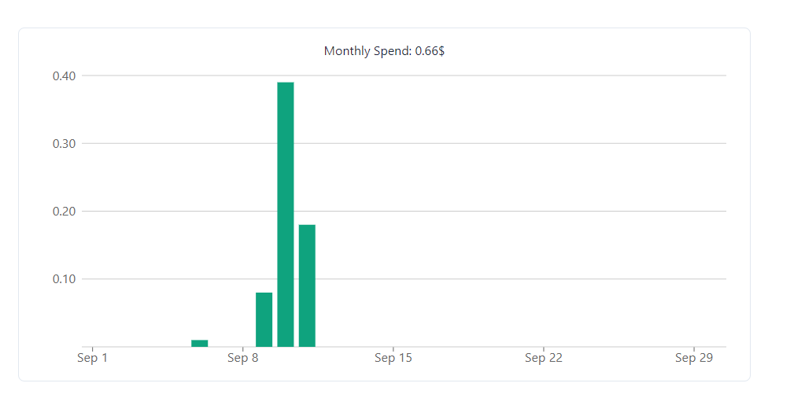

The app provides detailed insights into your monthly consumption, allowing you to track usage both in tokens and dollars. It also includes filtering options to monitor specific bots.

### 1. Monthly Token Consumption

You can view your monthly token consumption to monitor how much processing power is being utilized by your bots. This is particularly useful to ensure that you're optimizing resources effectively.

  
  
<em>Example of monthly consumption by tokens</em>

### 2. Monthly Dollar Consumption

In addition to tokens, the app also provides an overview of your monthly costs in dollars. This helps you manage and forecast expenses associated with your bot usage.

  
  
<em>Example of monthly consumption in dollars</em>

### 3. Filtering by Bots

The app allows you to filter data by specific bots, providing a more granular view of each bot's performance and usage. This is particularly helpful if you manage multiple bots and need to assess individual activity.

  
  
<em>Example of filtering option by bots</em>

By utilizing these features, you can stay on top of your usage, ensure cost-efficiency, and make better-informed decisions on how to allocate resources across different bots.

---
