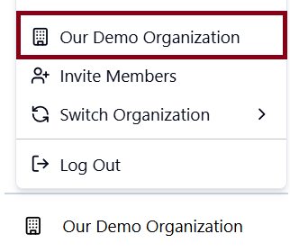
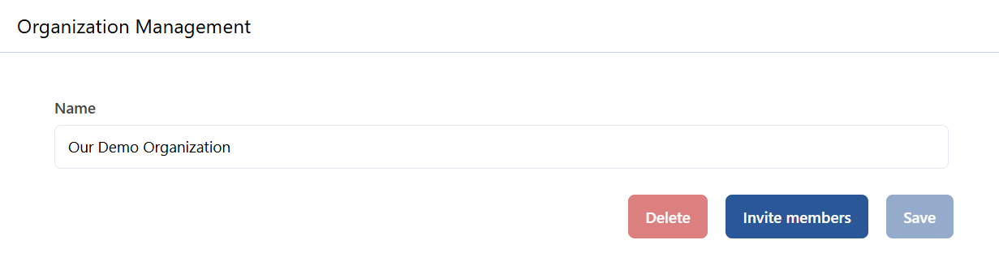
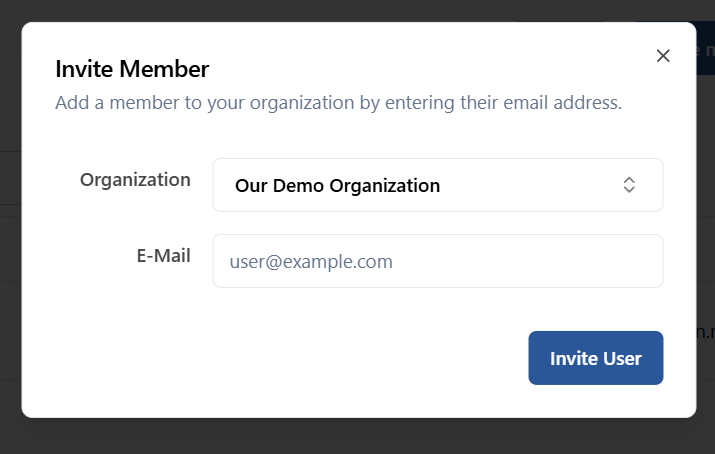
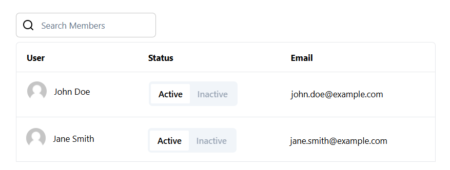
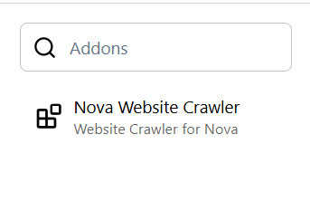

The app provides managing organizations within the system, including updating organization details, inviting members, managing existing members, and viewing available addons.

  
  
<em>Navigate to Organization Management</em>

## 1. Organization Details
The organization management section allows users to view and update the basic information about their organization.
- **Organization Name**: There is an input field where users can view and update the organization's name. Simply modify the name in the field and save the changes to update the organization’s name.
- **Delete Organization**: Users have the option to delete an organization. However, this action is only available if the organization is not current global organization. Attempting to delete an active organization will be restricted.

  
  
<em>Organization name update form and delete, invite members option</em>

## 2. Invite members
The interface includes a feature to invite members to the organization by entering their email addresses. Invitations are sent to potential members, who can then join the organization.

  
  
<em>Click on 'Invite Members' to send invitation</em>

## 3. Member Management
Each organization has a table that lists all its current members. The table provides important information about each member and allows users to manage their membership status.

The table includes the following details for each member:
- **Profile Picture**: A thumbnail image of the member.
- **Name**: The full name of the member.
- **Status**: Membership status. Inactive users cannot access the organization.
- **Email**: The member's email address.

  
  
<em>Table with information about organization members</em>

## 4. Organization Addons
Each organization may have access to a variety of addons that can extend its functionality. These addons are listed in a right side panel within the organization management interface.

- **Available Addons**: The system displays a list of available addons that the organization can use. These addons provide additional features or integrations specific to the organization’s needs.

  
  
<em>Browse or search for the desired addons available for organization</em>

## 5. Usage Flow
- **Update Organization Name**: Use the input field to modify the organization’s name and save the changes to update the information.
- **Delete an Organization**: If the organization is not currently active, users can delete it by clicking the delete button.
- **Invite New Members**: Enter email addresses to send invitations to potential new members of the organization.
- **View and Manage Members**: Use the member table to view each member’s profile picture, name and email. Manage their active/inactive status if permissions allow.
- **Explore Addons**: Browse the list of available addons to see what additional features are enabled for the organization.
